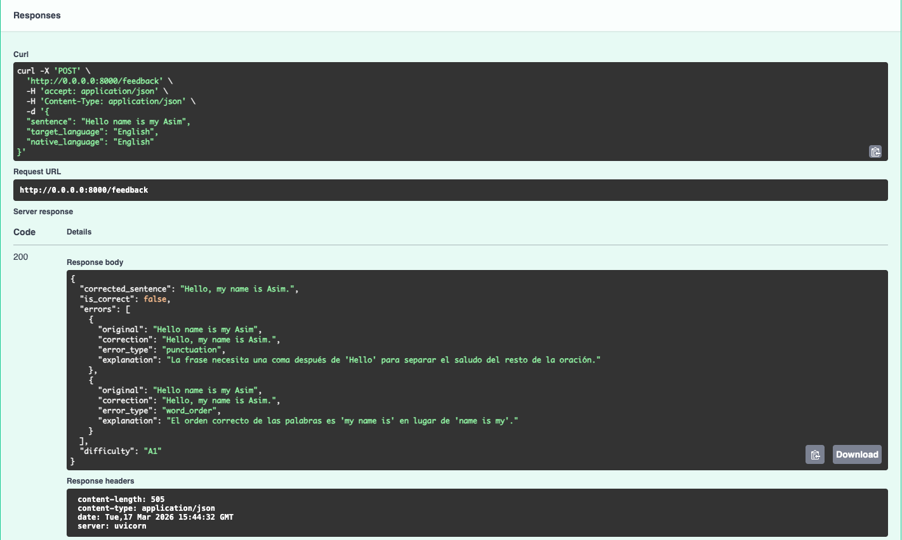
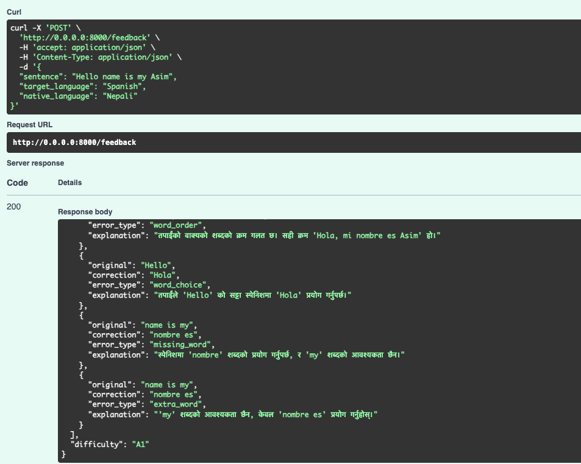
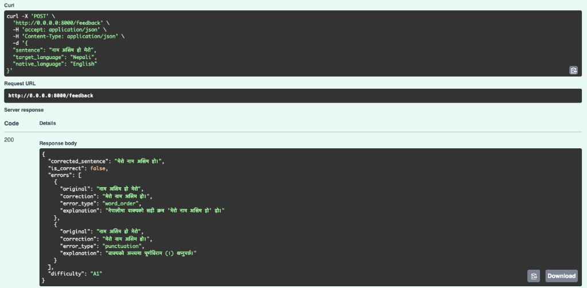
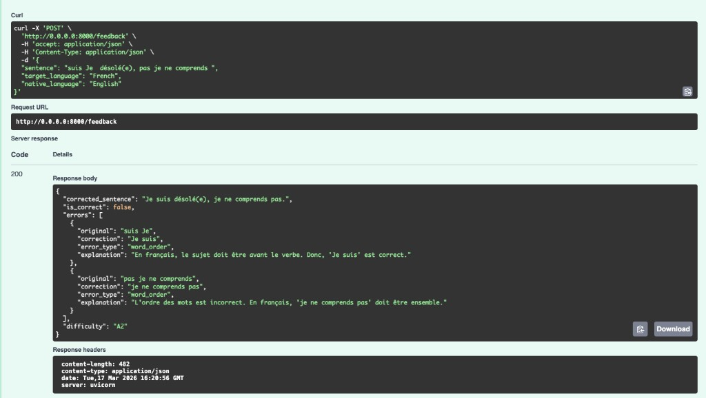
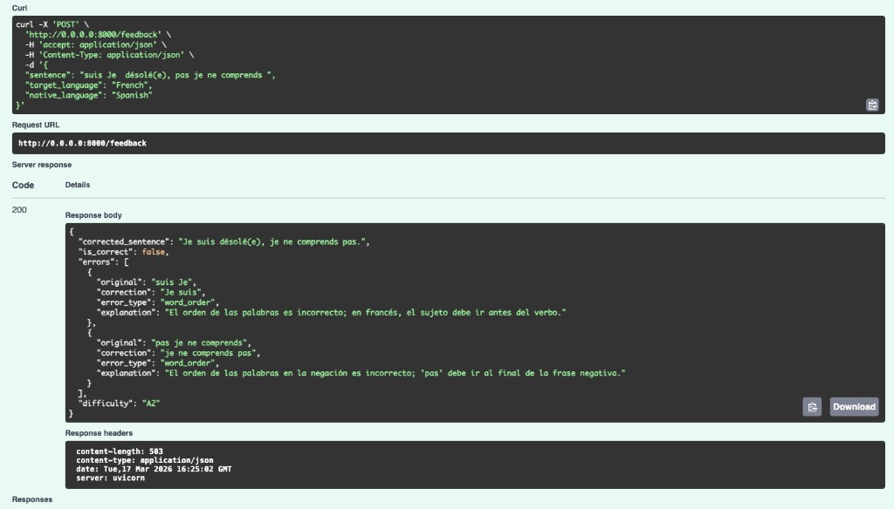

# Bug Report: Cross-Lingual Drift in Default System Prompt

## Summary

When using the **default (starter) system prompt**, the `/feedback` endpoint exhibits **cross-lingual drift** — the model writes error explanations in the `target_language` instead of the `native_language`. This occurs **consistently when `native_language` is English**, regardless of what the target language is. The explanations are factually accurate; only the language is wrong. This is an instruction-following failure, not a hallucination.

This is a critical UX problem: English-speaking learners — the primary audience — receive explanations in the language they are trying to learn, not the language they understand.

## Reproducing the Bug: Four Cases

### Case 1: `target_language: "Spanish"`, `native_language: "English"` — FAILS

```json
{
  "sentence": "Hello name is my Asim",
  "target_language": "English",
  "native_language": "English"
}
```

**Expected:** Explanations in English.
**Actual:** Explanations in Spanish.



### Case 2: `target_language: "Spanish"`, `native_language: "Nepali"` — WORKS

```json
{
  "sentence": "Hello name is my Asim",
  "target_language": "Spanish",
  "native_language": "Nepali"
}
```

**Expected:** Explanations in Nepali.
**Actual:** Explanations in Nepali. Correct.



### Case 3: `target_language: "Nepali"`, `native_language: "English"` — FAILS

```json
{
  "sentence": "नाम असिम हो मेरो",
  "target_language": "Nepali",
  "native_language": "English"
}
```

**Expected:** Explanations in English.
**Actual:** Explanations in Nepali. The corrections and error types are accurate, but the explanations are in the target language, not the native language.



### Case 4: `target_language: "French"`, `native_language: "English"` — FAILS

```json
{
  "sentence": "suis Je  désolé(e), pas je ne comprends ",
  "target_language": "French",
  "native_language": "English"
}
```

**Expected:** Explanations in English.
**Actual:** Explanations in French.



This confirms the bug is **not specific to Spanish**. It reproduces with French (and by extension, any target language) whenever `native_language` is English.

### Case 5: `target_language: "French"`, `native_language: "Spanish"` — WORKS

Same French sentence as Case 4, but `native_language` changed to **"Spanish"**:

```json
{
  "sentence": "suis Je  désolé(e), pas je ne comprends ",
  "target_language": "French",
  "native_language": "Spanish"
}
```

**Expected:** Explanations in Spanish.
**Actual:** Explanations in Spanish. Correct.



This is the same sentence and same target language as Case 4, but swapping `native_language` from English to Spanish immediately fixes the output. The bug is **exclusively an English-as-native-language problem**.

## The Pattern

| Case | target_language | native_language | Explanation language | Correct? |
|---|---|---|---|---|
| 1 | Spanish | English | Spanish | **No** |
| 2 | Spanish | Nepali | Nepali | Yes |
| 3 | Nepali | English | Nepali | **No** |
| 4 | French | English | French | **No** |
| 5 | French | Spanish | Spanish | Yes |

Every case where `native_language` is **English** fails. Every case where `native_language` is **anything else** succeeds. The model never produces English explanations — it always drifts into the target language instead.

## Why English Is "Invisible" to the Model

The system prompt itself is written in English. The model's internal reasoning happens in English. So when the prompt says "write explanations in the native language" and the native language *is* English, the model doesn't register this as requiring any language switch. English is its "default state" — there's no contrast signal.

Meanwhile, the target language creates strong contextual gravity: the sentence being analyzed is in that language, the corrections are in that language, and the error types relate to that language's grammar. Without a strong enough counter-signal from the `native_language` field, the model drifts into the target language for explanations too.

When `native_language` is something distinctive like Nepali, the model clearly recognizes it must produce output in a different language/script, so it follows the instruction.

## Why This Is Cross-Lingual Drift, Not Hallucination

| Term | Definition | Applies here? |
|---|---|---|
| **Hallucination** | The model invents false facts (e.g., a non-existent grammar rule). | No — the explanations are factually accurate in every case. |
| **Cross-lingual drift** | The model outputs text in a language other than the one instructed, because contextual cues from another language overpower the instruction. | Yes — the target language's contextual gravity overpowers the native language signal when native language is English. |

## Impact

This is not an edge case. **English-speaking learners studying any other language** are the most common use case for a language-learning app like Pangea Chat. The bug means the single largest user group receives explanations they may not understand — defeating the entire purpose of the feedback system.

## Root Cause

**Prompt brittleness.** The default system prompt says: *"explain the error in the learner's NATIVE language so they can understand."* This instruction is:

1. **Too indirect** — it doesn't name the specific language; it references a field.
2. **Not repeated** — a single mention is easily overridden by the target language context.
3. **Invisible for English** — because the prompt is already in English, the model doesn't treat "write in English" as a meaningful instruction to act on.

## Resolution

The updated system prompt (see `app/feedback.py`) addresses this with:

- A stronger, capitalized constraint: `"explanation" MUST be written in the learner's NATIVE language`
- Structural emphasis that separates the explanation-language rule from other formatting rules
- Additional reinforcement to make the language requirement harder for the model to ignore, especially when the native language is English
