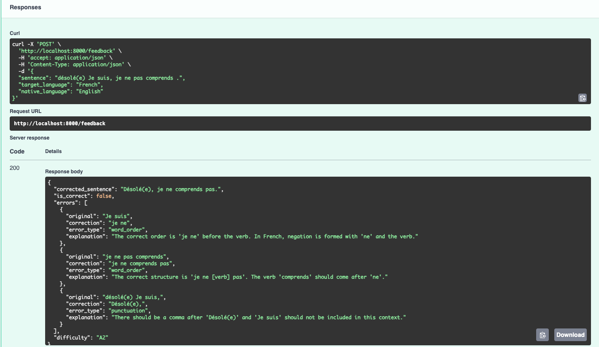
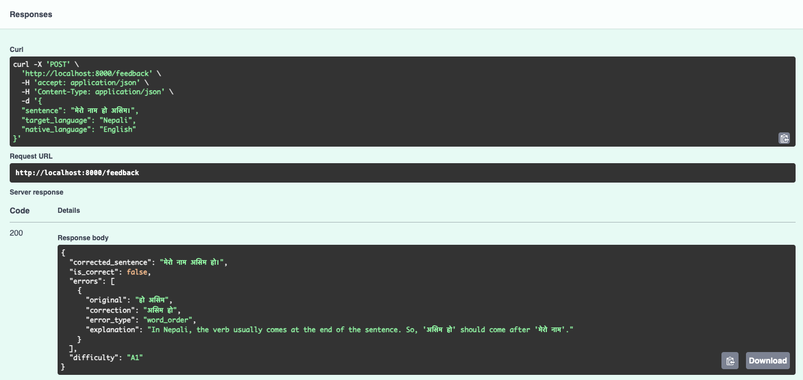

# Language Feedback API

An LLM-powered API that analyzes learner-written sentences and returns structured correction feedback. Built with Python, FastAPI, and OpenAI's `gpt-4o-mini`.

## How It Works

A learner submits a sentence they wrote in their target language (e.g., Spanish), along with their native language (e.g., English). The API sends this to an LLM with a carefully engineered system prompt and returns:

- A **minimally corrected sentence** that preserves the learner's voice
- A list of **specific errors**, each with the erroneous substring, its correction, an error category, and a plain-language explanation written in the learner's native language
- Whether the sentence **is correct** (boolean)
- A **CEFR difficulty rating** (A1-C2) based on sentence complexity

### Request

```
POST /feedback
```

```json
{
  "sentence": "Yo soy fue al mercado ayer.",
  "target_language": "Spanish",
  "native_language": "English"
}
```

### Response

```json
{
  "corrected_sentence": "Yo fui al mercado ayer.",
  "is_correct": false,
  "errors": [
    {
      "original": "soy fue",
      "correction": "fui",
      "error_type": "conjugation",
      "explanation": "You mixed two verb forms. 'Soy' is present tense of 'ser' and 'fue' is past tense of 'ir'. You only need 'fui' (I went)."
    }
  ],
  "difficulty": "A2"
}
```

## Running the Project

### With Docker (recommended)

```bash
cp .env.example .env
# Edit .env and add your OpenAI API key
docker compose up --build
```

The server starts on **port 8000**. Docker Compose runs a health check against `GET /health` automatically.

### Locally

```bash
python -m venv .venv
source .venv/bin/activate
pip install -r requirements.txt
cp .env.example .env
# Edit .env and add your OpenAI API key
uvicorn app.main:app --reload
```

### Running Tests

```bash
# Unit tests (no API key needed — uses mocked LLM responses)
pytest tests/test_feedback_unit.py tests/test_schema.py -v

# Integration tests (requires OPENAI_API_KEY in .env)
pytest tests/test_feedback_integration.py -v

# All tests
pytest -v
```

Tests can also run inside the Docker container:

```bash
docker compose exec feedback-api pytest -v
```

## Design Decisions

### Model: `gpt-4o-mini`

I chose `gpt-4o-mini` for the balance of cost, speed, and accuracy. It handles structured JSON output reliably, supports `response_format: json_object` natively, and responds well within the 30-second timeout. For a production language-learning app where every learner message triggers an API call, token cost matters — `gpt-4o-mini` is significantly cheaper than `gpt-4o` while still producing accurate multilingual corrections.

### Low temperature (0.2)

Language correction should be deterministic. The same sentence should get the same feedback every time. A low temperature reduces randomness in the output while still allowing the model enough flexibility to produce natural-sounding explanations.

### Pydantic validation as a safety net

The LLM's JSON output is parsed and validated through Pydantic models (`FeedbackResponse`, `ErrorDetail`) before being returned. If the model produces malformed output — missing fields, wrong types — Pydantic catches it at the application layer rather than letting invalid data reach the client.

### `response_format: json_object`

OpenAI's JSON mode guarantees the model output is valid JSON. Without this, the model occasionally wraps its response in markdown code fences or adds conversational text around the JSON, which breaks `json.loads()`.

### Caching for production feasibility

To keep costs low and latency predictable at scale, `get_feedback` in `app/feedback.py` now uses a simple in-memory **LRU (least recently used) cache**:

- **What is cached**: the full `/feedback` response, keyed by a hash of `(PROMPT_VERSION, model name, sentence, target_language, native_language)`. Changing the prompt or model automatically invalidates old entries.
- **How it works**: before calling OpenAI, the function looks up the key in an `OrderedDict` LRU. On a hit, it returns the cached JSON immediately; on a miss, it calls the model once and stores the parsed response in the cache.
- **Eviction**: the cache holds up to `FEEDBACK_CACHE_MAX_ITEMS` entries (default 1024). When it exceeds this, the least recently used entry is evicted.
- **Test isolation**: unit tests clear the cache between tests so mocked responses never leak across test cases.

This design improves **production feasibility** because:

- **Cost**: repeated or common sentences (e.g., classroom prompts, practice drills) only pay for one LLM call; all later requests are served from memory.
- **Latency**: cache hits are served in milliseconds, which helps keep p95/p99 latencies well below the 30-second scoring cutoff.
- **Throughput**: by offloading repeated work to the cache, the same infrastructure can handle more concurrent learners before hitting OpenAI rate limits.
- **Compatibility with Redis**: because the cache key is a single SHA-256 string and the value is JSON, it can be extended to a shared Redis cache (for multiple app instances) without changing the public API.

## Prompt Strategy

The prompt went through several iterations to fix specific failure modes discovered during testing.

### Problem: Cross-lingual drift

The default starter prompt told the model to "explain the error in the learner's NATIVE language." This worked when `native_language` was a distinctive language like Nepali, but **consistently failed when `native_language` was English**. The model would write explanations in the target language (Spanish, French, Nepali) instead of English.

This is documented in detail in [BUG_REPORT.md](BUG_REPORT.md) with five reproducible test cases.

The root cause: the system prompt itself is in English, so the model doesn't register "write in English" as a language switch. English is its default cognitive state — there's no contrast signal. The target language's contextual gravity (the sentence, corrections, and grammar concepts are all in that language) overpowers the weak instruction.

#### Why tests can still pass with the default prompt

The original integration tests (`tests/test_feedback_integration.py`) only assert that `explanation` is **non-empty** (plus schema-ish invariants like valid error types). They do **not** assert that `explanation` is written in the requested `native_language`. As a result, the cross-lingual drift bug can reproduce in real usage while the default integration tests still pass.

### The fix: three layers of reinforcement

1. **Explicit rules in the system prompt** with concrete examples:
   > "if the native language is English, write the explanation in English. If the native language is Spanish, write it in Spanish."

2. **Few-shot examples** baked into the system prompt showing English-native-language scenarios with explanations written in English. Models follow demonstrated patterns more reliably than abstract rules.

3. **Per-request reinforcement** in the user message:
   > `IMPORTANT: All explanations MUST be written in {native_language}.`
   
   This injects the actual language name into every request, right before the model generates. It's the single most effective fix because the model reads it last and it names the specific language rather than referencing a field.

### Result: explanations now in English

After applying the three-layer fix, both previously failing cases now return explanations in English as expected.

**French target language, English native language** -- previously returned French explanations, now returns English:



**Nepali target language, English native language** -- previously returned Nepali explanations, now returns English:



### Other prompt design choices

- **`original` must be an exact substring**: Without this rule, the model often set `original` to the entire input sentence for every error, giving the learner no granularity about what specifically was wrong.
- **Minimal correction**: The prompt emphasizes preserving the learner's meaning and style. Over-correcting (rewriting the whole sentence) is unhelpful for learning.
- **CEFR based on complexity, not errors**: Without this explicit instruction, the model tends to rate sentences with many errors as "simple" (A1), confusing error count with difficulty. A complex B2-level sentence with errors is still B2.
- **Allowed error types as an explicit enum**: Prevents the model from inventing categories like `"verb_tense"` or `"article"` that don't match the response schema.

## Test Suite

The test suite has 9 unit tests, 9 integration tests, and 9 schema tests covering 5 languages, 7 error types, and multiple edge cases.

### Unit tests (`tests/test_feedback_unit.py`) -- no API key needed

These mock the OpenAI client and verify the parsing pipeline works correctly.

| # | Test | Language | Error type | Edge case |
|---|---|---|---|---|
| 1 | Spanish conjugation error | Spanish | `conjugation` | Single error |
| 2 | Correct German sentence | German | -- | Correct sentence (no errors) |
| 3 | French gender agreement | French | `gender_agreement` | Multiple errors, same type |
| 4 | Portuguese spelling + grammar | Portuguese | `spelling` + `grammar` | Multiple errors, different types |
| 5 | Italian word order | Italian | `word_order` | -- |
| 6 | Spanish missing word | Spanish | `missing_word` | -- |
| 7 | German extra word | German | `extra_word` | -- |
| 8 | Correct Spanish sentence | Spanish | -- | Second correct sentence |
| 9 | Explanation field preserved | Spanish | `conjugation` | Explanation text survives parsing |

### Integration tests (`tests/test_feedback_integration.py`) -- requires API key

These hit the real OpenAI API and verify the prompt produces correct, well-structured output.

| # | Test | Language | What it checks |
|---|---|---|---|
| 1 | Spanish conjugation error | Spanish | Errors detected, valid schema |
| 2 | Correct German sentence | German | `is_correct=true`, sentence unchanged |
| 3 | French gender agreement | French | At least 2 errors found |
| 4 | Portuguese mixed errors | Portuguese | At least 2 distinct error types |
| 5 | Italian word order | Italian | Errors detected |
| 6 | Spanish missing word | Spanish | Errors detected |
| 7 | German extra word | German | Errors detected |
| 8 | Correct Spanish sentence | Spanish | `is_correct=true`, sentence unchanged |
| 9 | Explanation language regression | Spanish | Explanations are in English, not Spanish (cross-lingual drift fix) |

### Schema tests (`tests/test_schema.py`) -- no API key needed

Validates that request/response payloads conform to the JSON schemas in `schema/`, and that all examples in `examples/sample_inputs.json` are valid.

### Coverage summary

- **Languages**: Spanish, German, French, Portuguese, Italian (5 languages)
- **Error types**: `conjugation`, `gender_agreement`, `spelling`, `grammar`, `word_order`, `missing_word`, `extra_word` (7 types)
- **Edge cases**: correct sentences (2), multiple errors same type (1), multiple errors different types (1), explanation language regression (1)

## Project Structure

```
app/
  main.py           FastAPI app with /health and /feedback endpoints
  feedback.py       System prompt, user message construction, LLM call
  models.py         Pydantic models (FeedbackRequest, FeedbackResponse, ErrorDetail)
schema/
  request.schema.json    JSON Schema for request validation
  response.schema.json   JSON Schema for response validation
tests/
  test_feedback_unit.py         9 unit tests with mocked LLM responses
  test_feedback_integration.py  9 integration tests with real API calls
  test_schema.py                9 schema validation tests
examples/
  sample_inputs.json     5 example input/output pairs
test_scenarios/
  bug_report_*.png       Screenshots documenting the cross-lingual drift bug
Dockerfile               Python 3.11 slim image
docker-compose.yml       Single service (feedback-api) on port 8000
BUG_REPORT.md            Detailed analysis of the cross-lingual drift bug
```

## Verifying Accuracy for Unknown Languages

I don't speak most of the languages this API handles. To verify accuracy for languages I don't know, I:

1. Cross-checked the model's corrections against known example pairs in `examples/sample_inputs.json`
2. Used back-translation (feeding the corrected sentence into a translator and checking if the meaning is preserved)
3. Tested with intentionally obvious errors (wrong word order, missing prepositions, duplicated words) where the expected correction is unambiguous even without fluency
4. Verified the integration tests produce structurally valid responses across all 5 tested languages

For a production system, I would add automated accuracy checks using a second LLM as a judge, or build a human-reviewed test corpus for each supported language.

## What I Would Improve With More Time

- **Distributed caching**: The current in-memory LRU cache is per-process. In a multi-instance deployment I would add a small Redis layer in front of the LRU to share cached feedback across replicas and survive restarts.
- **Retry logic**: If the LLM returns malformed JSON or times out, the API should retry once before failing. Currently a single bad response returns a 500.
- **Language detection validation**: Use a lightweight library like `langdetect` to verify that explanations are actually in the requested native language, and retry if not.
- **Streaming**: For longer sentences, stream the response to reduce perceived latency.
- **Rate limiting**: Protect against abuse in a production deployment.
